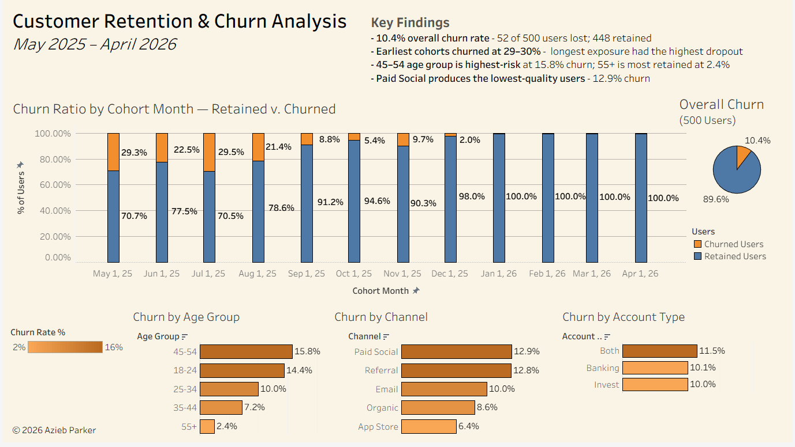
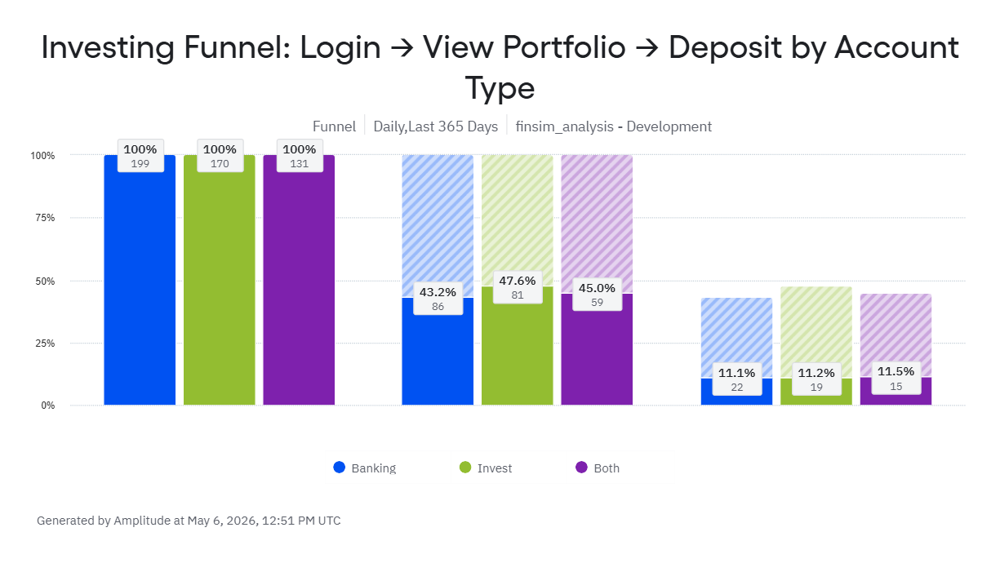
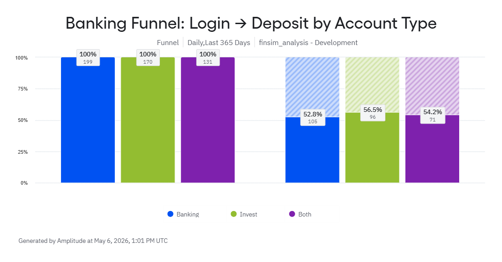
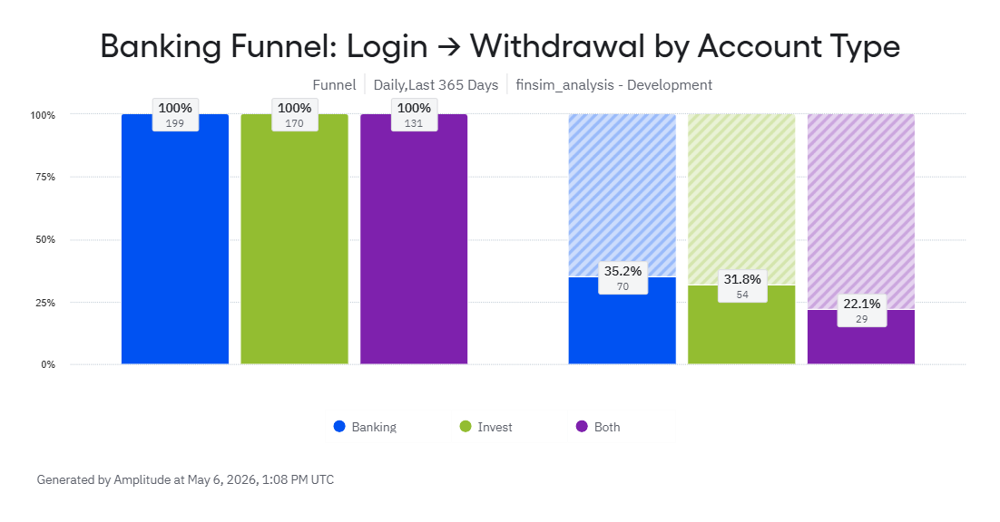
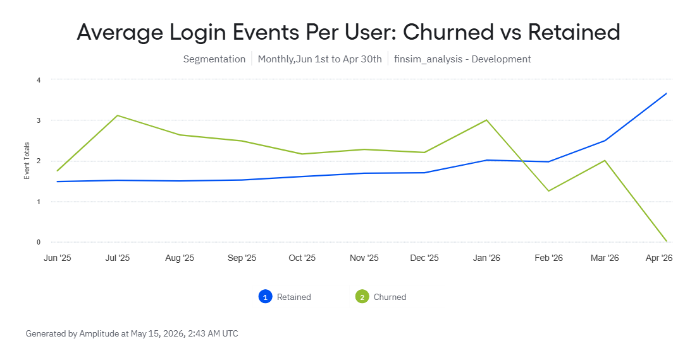
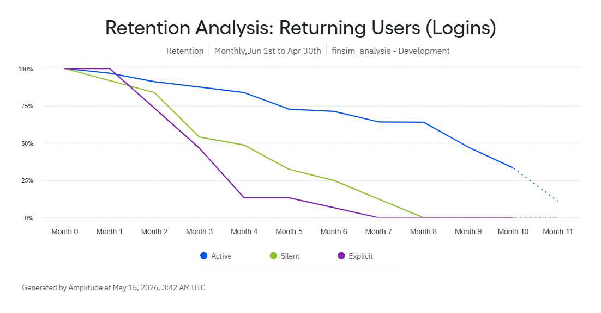
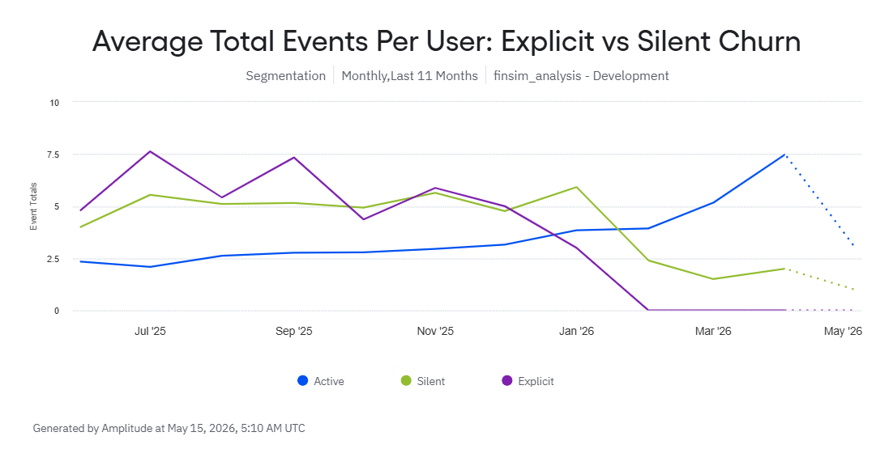


# FinSim - Customer Retention & Churn Analysis

**Azieb Tech** - [LinkedIn](https://www.linkedin.com/in/azieb-parker-08273016a/?skipRedirect=true) | [Live Tableau Dashboard](https://public.tableau.com/views/CustomerRetentionChurnAnalysis_17794163870410/FinsimCustomerRetentionChurnDashboard?:language=en-US&:sid=&:redirect=auth&:display_count=n&:origin=viz_share_link?)

---

## Table of Contents
- [Project Overview](#project-overview)
- [Analytical Objective](#analytical-objective)
- [PART 1: Macro KPI Tracking](#part-1-macro-kpi-tracking)
- [PART 2: Funnel Analysis & Behavioral Churn Diagnostics](#part-2-funnel-analysis--behavioral-churn-diagnostics)
- [PART 3: A/B Testing Hypotheses & Recommendations](#part-3-ab-testing-hypotheses--recommendations)
- [Appendix: Data Architecture & Methodology](#appendix-data-architecture--methodology)

### Project Overview
This project simulates the analytics workflow of a data analyst/engineer supporting the Banking and Investing product lines of a FinTech company such as Acorns. It uses a full-stack simulated data pipeline that includes raw data generation, SQL transformation, KPI dashboard delivery, and behavioral tracking to identify drop-off points in user funnels and uncover leading indicators of customer churn over a simulated 12-month period (May 2025–April 2026).

---

### Analytical Objective
Transform raw event data into actionable product recommendations that drive retention, reduce user friction, and answer key business questions:
* Which customers are churning, when are we losing them, and which segments require immediate retention interventions?
* Where in the Investing and Banking app experience is friction occurring?
* What product experiment hypotheses does the data support?

The following section presents high-level product platform metrics and churn benchmarks before we move into more detailed behavioral diagnostics.

---

## PART 1: MACRO KPI TRACKING 

**Overall platform churn sits at 10.4% for the period of May 2025-April 2026.**

[View the live Tableau dashboard](https://public.tableau.com/views/CustomerRetentionChurnAnalysis_17794163870410/FinsimCustomerRetentionChurnDashboard)

*Click the image above to interact with the live dashboard on Tableau Public.*

---

## PART 2: FUNNEL ANALYSIS & BEHAVIORAL CHURN DIAGNOSTICS

Before deploying product interventions, we must diagnose exactly *where* and *how* users are failing during their app experience. 

### 1. Investigating Funnel Friction
All three account types (Banking, Invest, Both) drop to approximately 11% conversion at the deposit stage. The near-uniform decline across segments (only a 0.4 percentage-point spread) suggests the friction is likely in the app experience or user flow rather than in user intent.

Furthermore, while deposit conversions are strong and uniform across all segments (~52-56%), withdrawal behavior shows clear differentiation. Both-product users withdraw at nearly half the rate (22.1%) of Banking-only users (35.2%). This proves both-product users treat the product as an investment vehicle rather than a purely transactional account.

  

### 2. Identifying Leading Indicators of Churn
Retained users show a steady increase in value; after six months of activity, their average login frequency doubles from 1.5 to over 3.6 logins per month. This shows that these users are integrating the app into their normal workflows.

In contrast, while churned users initially logged in more frequently than the retained cohort, their activity was highly sporadic before eventually flatlining. This suggests that churned users engaged with the app for isolated, one-off tasks rather than developing a consistent routine. The January 2026 point where retained activity overtook churned activity is a strong signal of healthier long-term users.

### 3. The Silent Exit vs. Explicit Cancellation
This section compares two types of churn behavior so stakeholders can see whether users are leaving by cancelling or by quietly disengaging.

Using a two-part churn taxonomy makes it easier to distinguish **Explicit Churners** (those who cancel) from **Silent Churners** (those who just stop transacting). Silent churners showed a multi-month decay curve, maintaining a ~50% return rate through Month 4 before steadily fading out completely by Month 8.

* **Pre-Churn Peak:** For the first six months of the lifecycle, both the Explicit and Silent churn cohorts maintain a higher average event volume per user than the retained "Active" cohort. The Explicit churn cohort peaks at an average of ~7.5 events per user in July and September 2025, while the Active cohort stays between 2 and 3 events.

* **The Crossover:** Between November 2025 and January 2026, the engagement levels cross over dramatically. Explicit churn falls to 0 events by February 2026. Silent churn lags slightly but plunges from ~6 events in January to ~2.5 events in February.

* **The Cliff:** January to February 2026 represents a notable decline in usage for both silent and explicit users. Up until this window, silent and explicit churners were highly active; after this window, their engagement drops below the active threshold, before explicit churners fade away entirely.

* **The Silver Lining (Opposing Trend Lines):** The retained users' percentage is declining over the 10-month analysis period, but this is not necessarily negative. At the same time, retained active users are using the app more frequently, which suggests the remaining cohort is becoming more engaged. Although the retained user base is smaller, the users who stay are showing stronger product engagement, indicating better long-term value and stickiness.

> *Data Note: Any sharp declines visible at the immediate tail end of the curves above are automated forecasts generated by Amplitude for incomplete current-month data, not a reflection of realized drops in actual user activity.*

---

## PART 3: A/B TESTING HYPOTHESES & RECOMMENDATIONS
Translating the diagnostics from Parts 1 and 2 into targeted actions that can potentially improve customer retention.

### For Product: A/B Testing Hypotheses

**1. The "One-Tap" Deposit**
* **The Problem:** 89% of users leave before actually depositing money. This could mean that the current process takes too much effort. 
* **The Test:** Version A (Current) vs. Version B (A "One-Tap" deposit button that automatically fills in their most frequent deposit amount).
* **The Goal:** Prove that removing the friction of typing increases the number of people who actually fund their accounts.

**2. The "Spare Change" Value Explained**
* **The Problem:** Both-product users rarely withdraw money, yet they paradoxically have the highest overall churn rate (11.5%), which could mean managing two accounts may feel confusing without clear value.
* **The Test:** Version A (Current) vs. Version B (customized dashboard module for both-account users that visualizes the tangible impact of their accounts working together. Specifically, it projects the long-term wealth generated by automatically investing their banking "spare change").
* **The Goal:** Shift the user's perspective from managing two separate accounts to benefiting from one unified financial engine. By clearly demonstrating the value of the both-product ecosystem, we aim to lower the overall churn rate of Both product users.

**3. The "We Miss You" Reminder**
* **The Problem:** Silent churners experience a multi-month fade out. We have a window of time to win them back before they are totally gone.
* **The Test:** Version A (Current) vs. Version B (If a user hasn't opened the app in 14 days, send a personalized push notification to pull them back in).
* **The Goal:** Determine if catching users early in their "fade out" phase successfully brings them back to regular, weekly app usage.

---

### Ad Hoc & Cross-Functional Recommendations
Additional recommendations for shifts in Marketing and Operations that may help plug the "leaks" in the user funnel.

* **Re-evaluate Acquisition Channels:** Paid Social has the highest churn (12.9%), while the App Store is the lowest (6.4%). Shift the budget toward higher-quality channels to garner higher value customers. The high Lifetime Value (LTV) of App Store users likely outweighs the cheaper lead costs of social media ads.

* **Targeted Deposit Support:** The deposit stage is the biggest bottleneck in the user journey. Trigger automated, proactive support emails (e.g., "Need help linking your external bank securely?") for users who have stalled for 48 hours at this step. Guide and encourage the customer to progress to the deposit stage, reducing friction between login and deposit events.

* **Explicit Churn Exit Surveys:** We can clearly identify users who take the action to "cancel" or "deactivate." Implement a mandatory one-question exit survey. This will categorize whether we are losing users to pricing, competitors, or technical bugs, providing a clear roadmap for future fixes.

* **Age-Specific Onboarding (45–54):** This is the highest-risk segment (15.8% churn). Instead of a generic dashboard showing a $12 balance, trigger a day-30 push notification stating: *"Your weekend coffee runs just bought your first fractional share of Apple! At this pace, your round-ups will cross $500 by next year."* This shifts focus to long-term benefits.

## APPENDIX: DATA ARCHITECTURE & METHODOLOGY

To emulate a modern production environment, this project uses a lightweight tech stack that mirrors enterprise data patterns (e.g., Databricks Delta tables).

* **Data Simulation:** Python (pandas, numpy) generates 500 synthetic users, alongside transactions and app events.
* **Behavioral Modeling:** A Weibull survival model is used to simulate realistic user lifespans so churn emerges from behavior rather than a fixed rate.
* **Storage:** DuckDB acts as a local columnar database for high-performance querying.
* **Transformation:** dbt-core + dbt-duckdb processes raw logs into cleaned staging views and aggregated mart tables.
* **Product Analytics:** Amplitude tracks funnel conversion, retention cohorts, and behavioral segmentation.
* **Visualization:** Tableau Public serves the macro-level KPI tracking.

---

> *Thank you for reviewing my analysis.*
> *Sincerely, Azieb*

[Back to Top](#table-of-contents)
